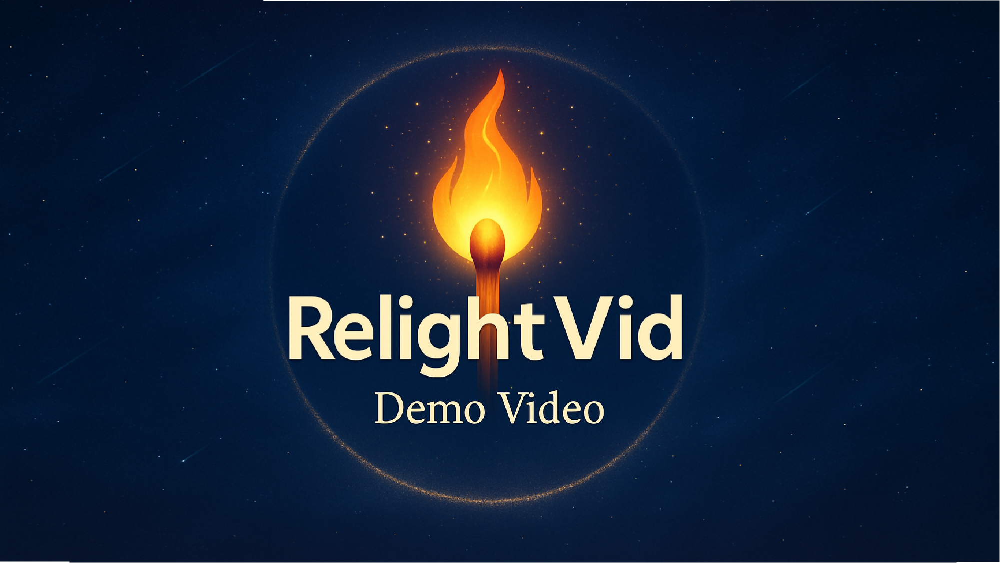

#  RelightVid
<!-- # RelightVid -->

**[RelightVid: Temporal-Consistent Diffusion Model for Video Relighting](https://aleafy.github.io/relightvid/)**
</br>
[Ye Fang](https://github.com/Aleafy)\*,
[Zeyi Sun](https://github.com/SunzeY)\*,
[Shangzhan Zhang](https://zhanghe3z.github.io/),
[Tong Wu](https://wutong16.github.io/),
[Yinghao Xu](https://justimyhxu.github.io/),
[Pan Zhang](https://panzhang0212.github.io/),
[Jiaqi Wang](https://myownskyw7.github.io/),
[Gordon Wetzstein](https://web.stanford.edu/~gordonwz/),
[Dahua Lin](http://dahua.site/)

<p style="font-size: 0.6em; margin-top: -1em">*Equal Contribution</p>

<!-- <p align="center">
<a href="https://arxiv.org/abs/2501.16330">"></a>
<a href="https://sunzey.github.io/Make-it-Real"></a>
<a href="https://www.youtube.com/watch?v=_j-t8592GCM"></a>
<a href="" target='_blank'>

</a>
</p> -->

<!-- 🌐 🧭 🏠 🌟 ⭐-->

<!-- <div align="center" style="font-family: Arial, sans-serif;">
  <p>
    <a href="https://prmbench.github.io/" style="text-decoration: none; font-weight: bold;">🌻 Homepage</a> •
    <a href="https://arxiv.org/abs/2501.03124" style="text-decoration: none; font-weight: bold;">📑 Paper</a> •
    <a href="https://huggingface.co/datasets/hitsmy/PRMBench_Preview" style="text-decoration: none; font-weight: bold;">🤗 Demo</a> •
    <a href="xxx" style="text-decoration: none; font-weight: bold;"> 🎬 Video</a>
  </p>
</div> -->


<p align="center">
<a href="https://arxiv.org/abs/2501.16330">"></a> &nbsp;
<a href="https://aleafy.github.io/relightvid"></a> &nbsp;
<a href="https://www.youtube.com/watch?v=8yTOgCgMyIM"></a>  &nbsp;
<a href="https://huggingface.co/spaces/aleafy/RelightVid">
    
  </a>
</p>


[](https://www.youtube.com/watch?v=8yTOgCgMyIM)


<!--  -->
<!-- ▶ [点击这里观看视频](https://files.catbox.moe/5kyifj.mp4) -->
<!-- [](https://files.catbox.moe/5kyifj.mp4) -->


## 📜 News
✨ [2025/3/25] The [github code](https://github.com/Aleafy/RelightVid), [project page](https://aleafy.github.io/relightvid/), [video](https://www.youtube.com/watch?v=8yTOgCgMyIM) and [huggingface demo](https://huggingface.co/spaces/aleafy/RelightVid) are released!

✨ [2025/1/27] We release the [paper](https://arxiv.org/abs/2501.16330) of RelightVid!

<!-- ## 💡 Highlights  
- 🔥 We propose **RelightVid**, a flexible framework for **realistic and temporally consistent video relighting** with excellent performance compared to existing baselines.  
- 🔥 We build **LightAtlas**, a large-scale video dataset with **real-world and 3D-rendered lighting pairs** to provide rich illumination priors.  
- 🔥 By incorporating **temporal layers**, the framework ensures strong **frame-to-frame consistency** while effectively preserving object albedo during the relighting process.  
- 🔥 Supporting diverse inputs such as **text prompts, background videos, and HDR maps**, **RelightVid** allows for versatile and adaptive lighting manipulation across various video scenarios. -->

## 💡 Highlights  
<!-- - 🔥 **RelightVid** introduces a flexible framework for **realistic and temporally consistent video relighting**, outperforming existing baselines with excellent performance across multiple metrics.   -->
<!-- - 🔥 A comprehensive **LightAtlas** dataset is created, combining **real-world and 3D-rendered lighting pairs** to provide a rich foundation of illumination priors.  -->
- 🔥 We propose **RelightVid**, a flexible framework for **realistic and temporally consistent video relighting** with excellent performance compared to existing baselines.  
- 🔥 We build **LightAtlas**, a large-scale video dataset with **real-world and 3D-rendered lighting pairs** to provide rich illumination priors.  
- 🔥 By incorporating **temporal layers**, the framework ensures strong **frame-to-frame consistency** while maintaining high-quality **relighting** throughout the video.  
- 🔥 Supporting diverse inputs such as **text prompts, background videos, and HDR maps**, **RelightVid** allows for versatile and adaptive lighting manipulation across various video scenarios.

<!-- 
## 👨‍💻 Todo
- [ ] Evaluation for Existed and Model-Generated Assets (both code & test assets)
- [ ] More Interactive Demos (huggingface, jupyter) 
- [x] Make-it-Real Pipeline Inference Code
- [x] Highly detailed Material Library annotations (generated by GPT-4V) 
- [x] Paper and Web Demos -->

## 💾 Installation

   ```bash
   git clone https://github.com/Aleafy/RelightVid.git
   cd RelightVid

   conda create -n relitv python=3.10 
   conda activate relitv
   
   pip install torch==2.1.2 torchvision==0.16.2 --index-url https://download.pytorch.org/whl/cu118
   pip install -r requirements.txt
   ```


## 📦 Model Preparation
<!-- To reproduce the results, please download the following models ([IC-Light](https://huggingface.co/lllyasviel/ic-light/tree/main), [RealisticVision-v51](https://huggingface.co/stablediffusionapi/realistic-vision-v51/tree/main), [RelightVid](https://huggingface.co/aleafy/RelightVid/tree/main)), and organize them according to the following directory structure: -->

To reproduce the results, please download the following models, and organize them according to the following directory structure:

- [IC-Light](https://huggingface.co/lllyasviel/ic-light/tree/main)
- [RealisticVision-v51](https://huggingface.co/stablediffusionapi/realistic-vision-v51/tree/main)
- [RelightVid](https://huggingface.co/aleafy/RelightVid/tree/main)

You can download all the models through [here]().
 <!-- 1. **Annotations**: in `data/material_lib/annotations` [folder](data/material_lib/annotations), include:
    - Highly-detailed descriptions by GPT-4V: offering thorough descriptions of the material’s visual characteristics and rich semantic information.
    - Category-tree: Divided into a hierarchical structure with coarse and fine granularity, it includes over 80 subcategories.
 2. **PBR Maps**: You can download the complete PBR data collection at [Huggingface](https://huggingface.co/datasets/gvecchio/MatSynth/tree/main), or download the data used in our project at [OpenXLab](https://openxlab.org.cn/datasets/YeFang/MatSynth/tree/main) (Recommended). (If you have any questions, please refer to [issue#5](https://github.com/Aleafy/Make_it_Real/issues/5))
 3. **Material Images(optinal)**: You can download the material images file [here](https://drive.google.com/file/d/1ob7CV6JiaqFyjuCzlmSnBuNRkzt2qMSG/view?usp=sharing), to check and visualize the material appearance. -->

<!-- <pre>
RelightVid
└── models
    └── realistic-vision-v51                              // stable diffusion base model
        └── text_encoder
            ├── config.json
            └── model.safetensors
        └── tokenizer
            ├── merges.txt
            ├── special_tokens_map.json
            ├── tokenizer_config.json
            └── vocab.json
        └── unet
            └── diffusion_pytorch_model.safetensors
        └── vae
            ├── config.json
            └── diffusion_pytorch_model.safetensors
    └── iclight_sd15_fbc.safetensors                      // ic-light weights
    └── relvid_mm_sd15_fbc.pth                            // relightvid motion weights
</pre> -->


<pre>
RelightVid
├── models
│   ├── realistic-vision-v51                              // stable diffusion base model
│   │   ├── text_encoder
│   │   │   ├── config.json
│   │   │   └── model.safetensors
│   │   ├── tokenizer
│   │   │   ├── merges.txt
│   │   │   ├── special_tokens_map.json
│   │   │   ├── tokenizer_config.json
│   │   │   └── vocab.json
│   │   ├── unet
│   │   │   └── diffusion_pytorch_model.safetensors
│   │   ├── vae
│   │   │   ├── config.json
│   │   │   └── diffusion_pytorch_model.safetensors
│   ├── iclight_sd15_fbc.safetensors                      // ic-light weights
│   ├── relvid_mm_sd15_fbc.pth                            // relightvid motion weights
</pre>


## ⚡ Quick Start
<!-- #### Background-conditioned illumination control -->
### Perform video relighting with customized background condition
```bash
python inference.py \
  --input "./assets/input/lion.mp4" \
  --mask "./assets/mask/lion" \
  --bg_cond "./assets/video_bg/stage_light2.mp4" \
  --output_path "output/lion_stagelight2.mp4"
```
Here, `--input` is the original video, `--mask` is the per-frame foreground mask directory, `--bg_cond` is the background lighting condition video, and `--output_path` is where the relit result will be saved. You can freely combine any input video with any background video.


<details><summary>Click for more example bash commands of RelightVid</summary>

```bash
python inference.py --input "./assets/input/woman.mp4" --mask "./assets/mask/woman" --bg_cond "./assets/video_bg/universe1.mp4" --output_path "output/woman_universe1.mp4"
```
```bash
python inference.py --input "./assets/input/woman.mp4" --mask "./assets/mask/woman" --bg_cond "./assets/video_bg/beach.mp4" --output_path "output/woman_beach.mp4"
```
```bash
python inference.py --input "./assets/input/man.mp4" --mask "./assets/mask/man" --bg_cond "./assets/video_bg/tunnel.mp4" --output_path "output/man_tunnel.mp4"
```
```bash
python inference.py --input "./assets/input/man2.mp4" --mask "./assets/mask/man2" --bg_cond "./assets/video_bg/fantasy.mp4" --output_path "output/man2_fantasy.mp4"
```
```bash
python inference.py --input "./assets/input/lion.mp4" --mask "./assets/mask/lion" --bg_cond "./assets/video_bg/stage_light1.mp4" --output_path "output/lion_stagelight1.mp4"
```
```bash
python inference.py --input "./assets/input/truck.mp4" --mask "./assets/mask/truck" --bg_cond "./assets/video_bg/universe3.mp4" --output_path "output/truck_universe3.mp4"
```
```bash
python inference.py --input "./assets/input/truck.mp4" --mask "./assets/mask/truck" --bg_cond "./assets/video_bg/universe1.mp4" --output_path "output/truck_universe1.mp4"
```
```bash
python inference.py --input "./assets/input/glass.mp4" --mask "./assets/mask/glass" --bg_cond "./assets/video_bg/snow.mp4" --output_path "output/glass_snow.mp4"
```
```bash
python inference.py --input "./assets/input/dance.mp4" --mask "./assets/mask/dance" --bg_cond "./assets/video_bg/sunscape.mp4" --output_path "output/dance_sunscape.mp4"
```
</details>
<!-- - To ensure proper network connectivity for GPT-4V, add proxy environment settings in [main.py](https://github.com/Aleafy/Make_it_Real/blob/feb3563d57fbe18abbff8d4abfb48f71cc8f967b/main.py#L18) (optional). Also, please verify the reachability of your [API host](https://github.com/Aleafy/Make_it_Real/blob/feb3563d57fbe18abbff8d4abfb48f71cc8f967b/utils/gpt4_query.py#L68).
- Result visualization (blender engine) is located in the `output/refine_output` dir. You can compare the result with that in `output/ori_output`.  -->


## 📝 TODO List
- [✔] Release the arxiv and the project page.
- [✔] Release the relighting inference code and huggingface demo using background condition.
- [ ] Release the relighting inference code using more (text/hdr) conditions.
- [ ] Release LightAtlas data augmentation pipeline and datasets. 
- [ ] Release training and evaluation code.


## ✒️ Citation
If you find our work helpful for your research, please consider giving a star ⭐ and citation 📝
```bibtex
@article{fang2025relightvid,
  title={RelightVid: Temporal-Consistent Diffusion Model for Video Relighting},
  author={Fang, Ye and Sun, Zeyi and Zhang, Shangzhan and Wu, Tong and Xu, Yinghao and Zhang, Pan and Wang, Jiaqi and Wetzstein, Gordon and Lin, Dahua},
  journal={arXiv preprint arXiv:2501.16330},
  year={2025}
}
```

## 📄 License
<a rel="license" href="http://creativecommons.org/licenses/by-nc-sa/4.0/"></a>
<br />
This work is under the <a rel="license" href="http://creativecommons.org/licenses/by-nc-sa/4.0/">Creative Commons Attribution-NonCommercial-ShareAlike 4.0 International License</a>.


## 📚 Related Works
- [AnimateDiff](https://github.com/guoyww/animatediff/): A text-to-video diffusion framework that extends image diffusion models with lightweight temporal modules for generating coherent and controllable animations.
- [IC-Light](https://github.com/lllyasviel/IC-Light):  enables intuitive lighting control in image generation by integrating editable illumination conditions into diffusion models.
- [Relightful Harmonization](https://arxiv.org/abs/2312.06886): introduces a method for consistent subject relighting in diverse scenes using synthetic data and background guidance.
- [Switchlight](https://arxiv.org/pdf/2402.18848): performs intrinsic decomposition of portraits into identity and lighting components, enabling flexible and realistic relighting through disentangled editing.

